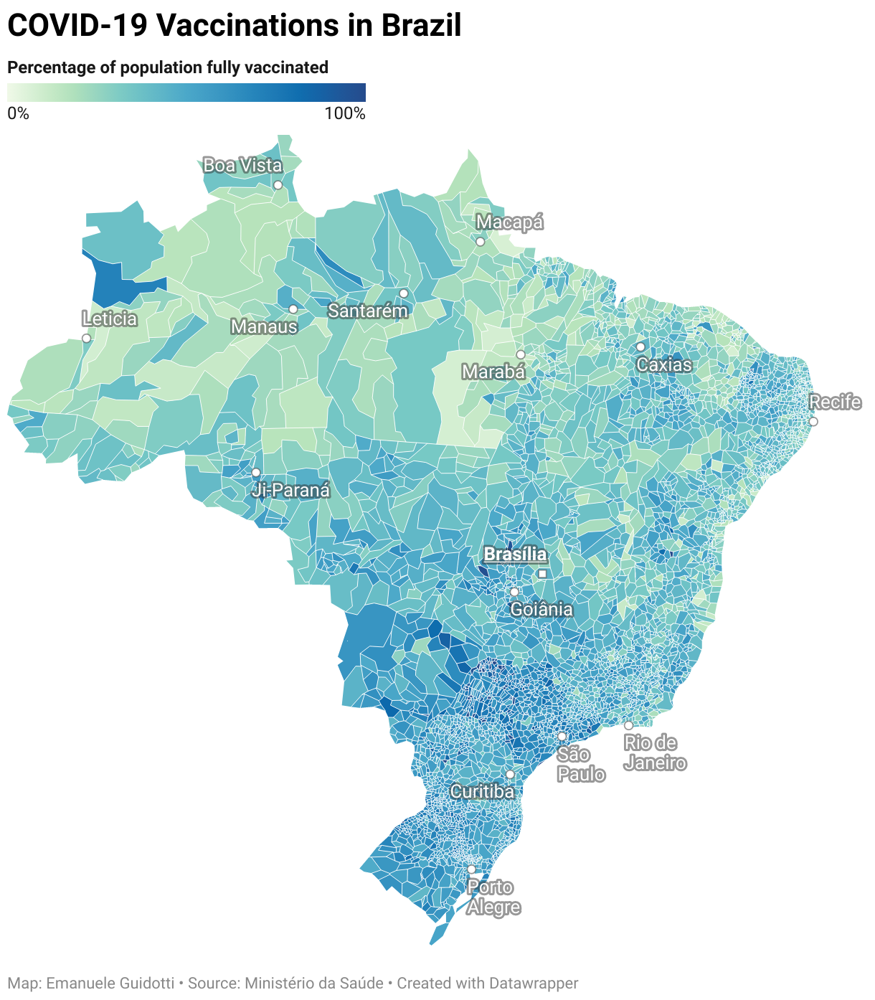

# COVID-19 Vaccinations for Brazilian Municipalities

The Ministry of Health, through the Information System of the National Immunization Program (SI-PNI), makes available data relating to the National Vaccination Campaign against Covid-19 [here](https://opendatasus.saude.gov.br/dataset/covid-19-vacinacao).

The dataset is provided in a tidy data format, where each row represents an administered COVID-19 dose. There are 250+ million records and 30+ variables associated with each record. The dataset is over 130GB.

This repository extracts the time-series of administrated doses from the 130GB dataset and makes it available in the form of lightweight ready-to-use CSV files with the following structure:

| field                   | description                                                  |
| ----------------------- | ------------------------------------------------------------ |
| `IBGE`                  | 7 digits IBGE code to identify Brazilian municipalities      |
| `Municipio`             | The name of the municipality                                 |
| `Population`            | The total population (2021)                                  |
| `Date`                  | Date in the format YYYY-MM-DD                                |
| `TotalVaccinations`     | Total number of COVID-19 vaccination doses administered      |
| `PeopleVaccinated`      | Total number of people who received at least one vaccine dose |
| `PeopleFullyVaccinated` | Total number of people who received all doses prescribed by the vaccination protocol |

## Data files

- `population.csv`: contains the population data. 
  - https://raw.githubusercontent.com/eguidotti/covid19br/main/population.csv 
- `vaccines.csv.gz`: contains the time-series vaccination data for each municipality. The file `vaccines-latest.csv` contains only the latest counts.
  - https://raw.githubusercontent.com/eguidotti/covid19br/main/vaccines.csv.gz
  - https://raw.githubusercontent.com/eguidotti/covid19br/main/vaccines-latest.csv
- `data.csv.gz`: contains the time-series of vaccination data merged with population. The file `data-latest.csv` contains only the latest counts for each municipality. These are the main files intended for re-use.
  - https://raw.githubusercontent.com/eguidotti/covid19br/main/data.csv.gz
  - https://raw.githubusercontent.com/eguidotti/covid19br/main/data-latest.csv

## How it works

- The script `download.R` is run by several workflows to download the data for each state. The output is saved in the folder `download`

- The script `vaccines.R` reads the data files from the folder `download` and generates the files `vaccines.csv.gz` and `vaccines-latest.csv`
- The script `data.R` merges the files `vaccines.csv.gz` and `population.csv` to generate the files `data.csv.gz` and `data-latest.csv`

## Data sources

- The vaccination data are from the [Ministério da Saúde](https://opendatasus.saude.gov.br/dataset/covid-19-vacinacao)
- The population data are from the [Instituto Brasileiro de Geografia e Estatística](https://www.ibge.gov.br/en/statistics/social/population/18448-estimates-of-resident-population-for-municipalities-and-federation-units.html)

## Data license

[](http://opendefinition.org/okd/)

[Creative Commons Attribution](http://www.opendefinition.org/licenses/cc-by) 

## Workflows

[](https://github.com/eguidotti/covid19br/actions/workflows/_data.yaml)

All the files are updated daily.

|Estados|Status|
|-------|------|
|Acre|[](https://github.com/eguidotti/covid19br/actions/workflows/AC.yaml)|
|Alagoas|[](https://github.com/eguidotti/covid19br/actions/workflows/AL.yaml)|
|Amapá|[](https://github.com/eguidotti/covid19br/actions/workflows/AP.yaml)|
|Amazonas|[](https://github.com/eguidotti/covid19br/actions/workflows/AM.yaml)|
|Bahia|[](https://github.com/eguidotti/covid19br/actions/workflows/BA.yaml)|
|Ceará|[](https://github.com/eguidotti/covid19br/actions/workflows/CE.yaml)|
|Distrito Federal|[](https://github.com/eguidotti/covid19br/actions/workflows/DF.yaml)|
|Espírito Santo|[](https://github.com/eguidotti/covid19br/actions/workflows/ES.yaml)|
|Goiás|[](https://github.com/eguidotti/covid19br/actions/workflows/GO.yaml)|
|Maranhão|[](https://github.com/eguidotti/covid19br/actions/workflows/MA.yaml)|
|Mato Grosso|[](https://github.com/eguidotti/covid19br/actions/workflows/MT.yaml)|
|Mato Grosso do Sul|[](https://github.com/eguidotti/covid19br/actions/workflows/MS.yaml)|
|Minas Gerais|[](https://github.com/eguidotti/covid19br/actions/workflows/MG.yaml)|
|Pará|[](https://github.com/eguidotti/covid19br/actions/workflows/PA.yaml)|
|Paraíba|[](https://github.com/eguidotti/covid19br/actions/workflows/PB.yaml)|
|Paraná|[](https://github.com/eguidotti/covid19br/actions/workflows/PR.yaml)|
|Pernambuco|[](https://github.com/eguidotti/covid19br/actions/workflows/PE.yaml)|
|Piauí|[](https://github.com/eguidotti/covid19br/actions/workflows/PI.yaml)|
|Rio de Janeiro|[](https://github.com/eguidotti/covid19br/actions/workflows/RJ.yaml)|
|Rio Grande do Norte|[](https://github.com/eguidotti/covid19br/actions/workflows/RN.yaml)|
|Rio Grande do Sul|[](https://github.com/eguidotti/covid19br/actions/workflows/RS.yaml)|
|Rondônia|[](https://github.com/eguidotti/covid19br/actions/workflows/RO.yaml)|
|Roraima|[](https://github.com/eguidotti/covid19br/actions/workflows/RR.yaml)|
|Santa Catarina|[](https://github.com/eguidotti/covid19br/actions/workflows/SC.yaml)|
|São Paulo|[](https://github.com/eguidotti/covid19br/actions/workflows/SP.yaml)|
|Sergipe|[](https://github.com/eguidotti/covid19br/actions/workflows/SE.yaml)|
|Tocantins|[](https://github.com/eguidotti/covid19br/actions/workflows/TO.yaml)|

## Visualization

An interactive visualization of the latest data is available [here](https://datawrapper.dwcdn.net/RBpM2/).



## Cite as

I have invested a lot of time and effort in creating this resource to simplify the access to the data. If you use the data files from this repository, please cite:

*Guidotti, E., (2021), "Crunching COVID-19 Vaccination Data for Brazilian Municipalities", Working Paper.*

A BibTeX entry for LaTeX users is:

```latex
@unpublished{covid19br,
  author = {Emanuele Guidotti},
  title = {Crunching COVID-19 Vaccination Data for Brazilian Municipalities},
  note = {Working Paper},
  url = {https://github.com/eguidotti/covid19br/blob/main/joss/paper.pdf} 
}
```

You can find the working paper [here](https://github.com/eguidotti/covid19br/blob/main/joss/paper.pdf)